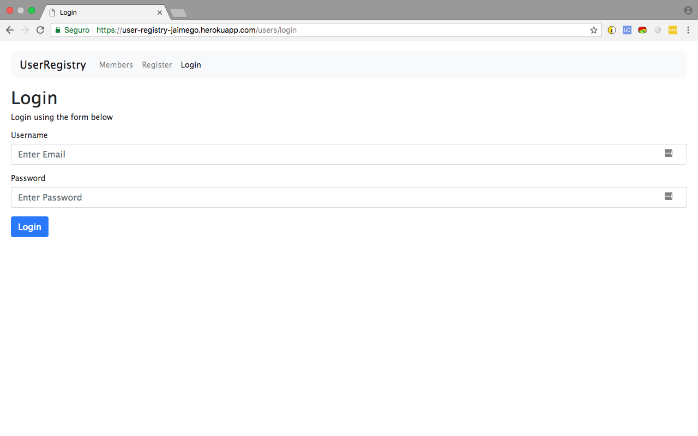
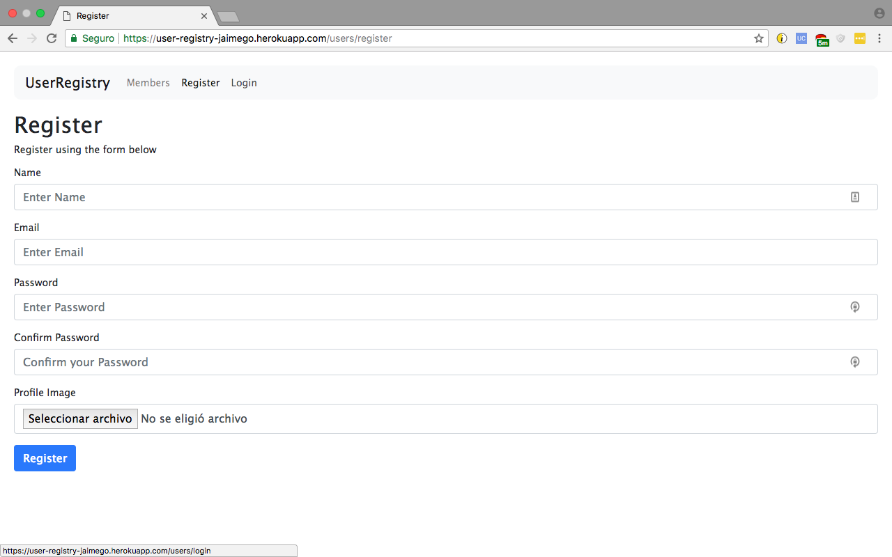
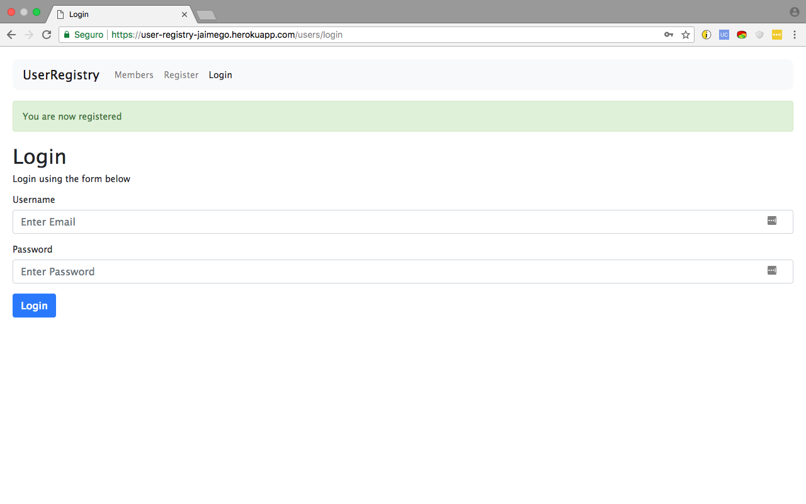
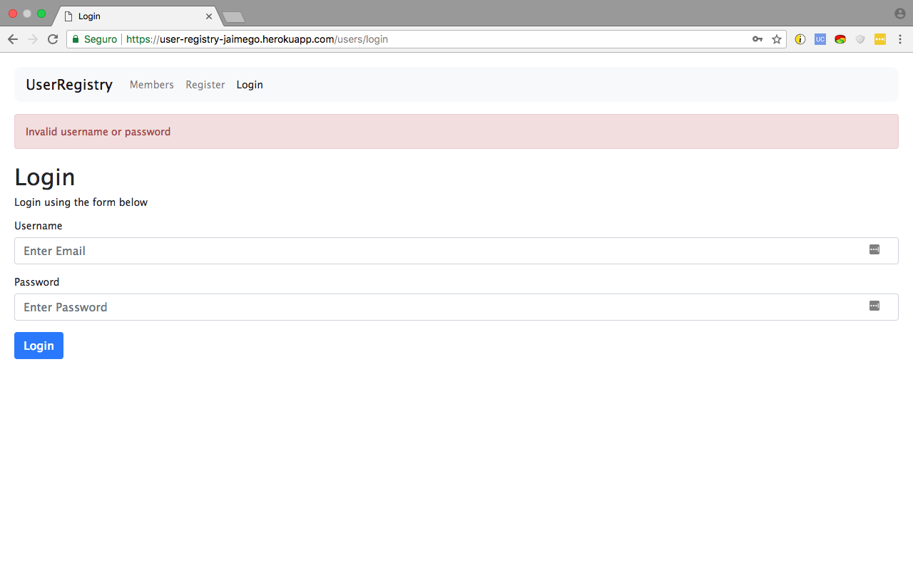

# user-registry

Simple Express aplication with register, login and logout.

It's made with bootstrap, shows custom flash messages with connect-flash, uses Mongo as a database, bcrypt to encrypt passwords, and it allows users to upload their profile picture with the multer module.

It can be found in Heroku at: https://user-registry-jaimego.herokuapp.com/

## Login

## Register

## Flash message (success)

## Flash message (fail)

